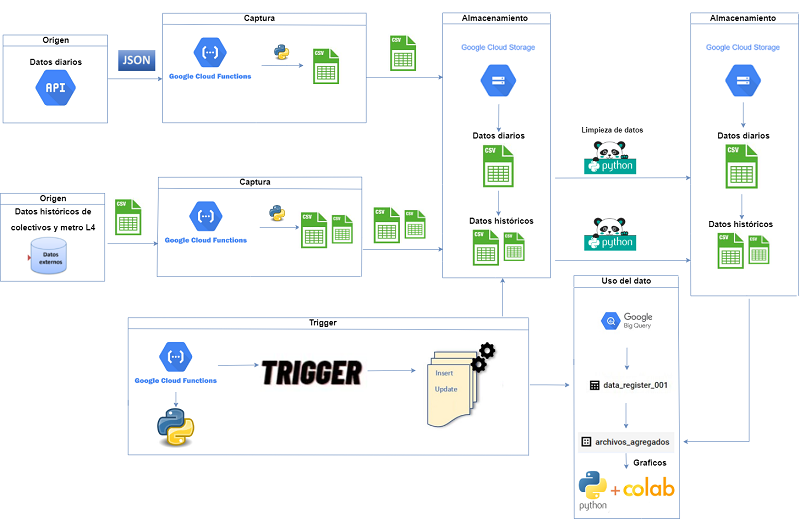

# Proyecto de ETL para Transporte Público

Este proyecto tiene como objetivo principal extraer, transformar y cargar datos relacionados con servicios de transporte público desde diversas APIs. Los datos extraídos se almacenan en Google Cloud Storage y se procesan en BigQuery para realizar análisis posteriores que apoyen la toma de decisiones.



## Contenido
- [Requisitos](#requisitos)
- [Estructura del Proyecto](#estructura-del-proyecto)
- [Instrucciones de Ejecución](#instrucciones-de-ejecución)

---

## Requisitos

Para ejecutar este proyecto, necesitas:

- **Google Cloud Platform (GCP)**: 
  - Configuración de Google Cloud Storage para almacenar datos.
  - BigQuery para procesar los datos.
- **APIs de Transporte Público**: Acceso a las APIs de las cuales se extraerán los datos.
- **Python**: Instalación de Jupyter Notebook y bibliotecas necesarias para la ejecución de los notebooks.
- **Credenciales de GCP**: Un archivo JSON con las credenciales de servicio para interactuar con la plataforma.

Instala las dependencias del proyecto ejecutando:

```bash
pip install -r requirements.txt
```

## Estructura del Proyecto

El proyecto está organizado de la siguiente manera:

- **files/**
  Contiene documentos relacionados con el proyecto:
  - `Informe TRANSPORTEPUBLICO.docx` - Informe técnico del proyecto.
  - `Presentación Examen.pptx` - Presentación relacionada con el examen final del proyecto.

- **images/**
  Contiene imágenes relacionadas con la arquitectura y el flujo del proyecto:
  - `ark2.png` - Arquitectura del proyecto.
  - `gcp2.png` - Representación visual del uso de GCP.

- **scripts/**
  Contiene los notebooks de Jupyter que implementan los diferentes procesos del proyecto:
  - `DataMetro.ipynb` - Extracción y transformación de datos del sistema de metro.
  - `DatapuenteAll.ipynb` - Procesamiento de datos relacionados con conexiones entre servicios.
  - `EXAMENCOLABFINAL.ipynb` - Notebook para la ejecución de un análisis específico.
  - `TriggerMetaData.ipynb` - Automatización de procesos mediante triggers de metadatos.

## Instrucciones de Ejecución

### 1. Configuración del Entorno

1. Configura tus credenciales de GCP descargando el archivo JSON correspondiente y colócalo en el directorio raíz del proyecto.
2. Configura tus variables de entorno para que Python pueda autenticarte en GCP:
   ```bash
   export GOOGLE_APPLICATION_CREDENTIALS="path/to/your/credentials.json"
   ```

### 2. Ejecución de Notebooks

1. Abre un terminal y ejecuta Jupyter Notebook:
   ```bash
   jupyter notebook
   ```
2. Navega a la carpeta `scripts/` y abre los notebooks necesarios.
3. Ejecuta los notebooks en el siguiente orden:
   - `DataMetro.ipynb`: Para extraer y transformar datos del sistema de metro.
   - `DatapuenteAll.ipynb`: Para procesar datos relacionados con servicios de transporte conectados.
   - `TriggerMetaData.ipynb`: Para automatizar procesos relacionados con metadatos.

### 3. Almacenamiento y Análisis

1. Verifica que los datos procesados se hayan almacenado correctamente en Google Cloud Storage.
2. Utiliza BigQuery para ejecutar consultas sobre los datos almacenados y generar informes.

---